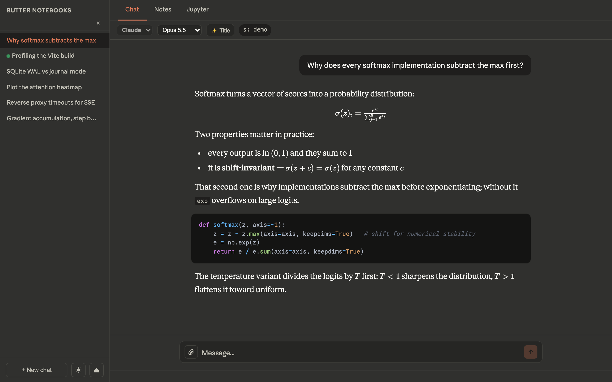
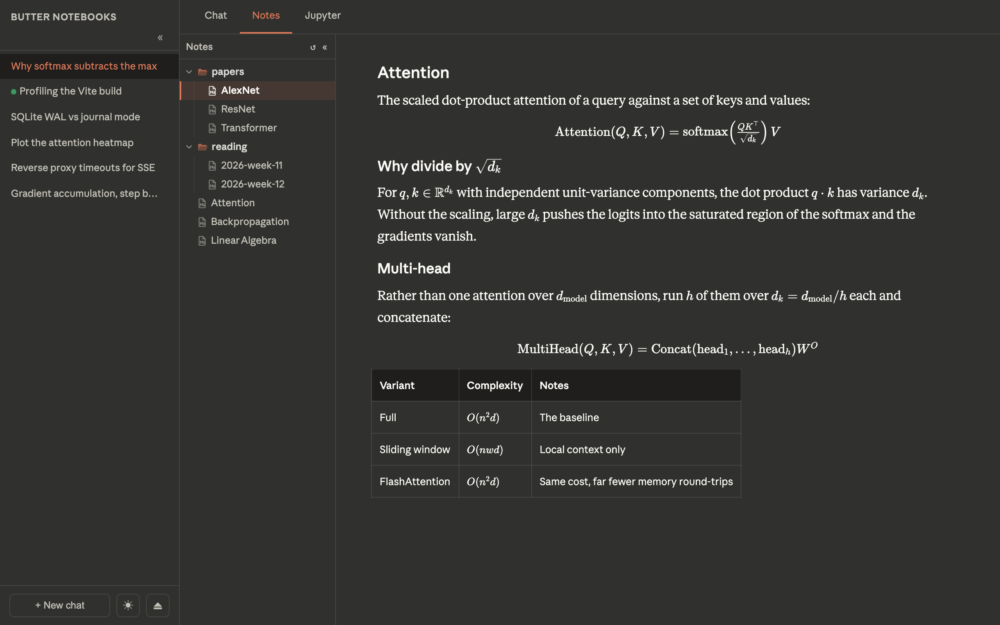
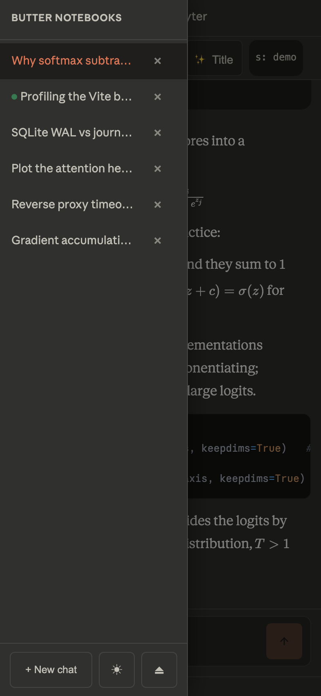

# butter notebooks

**A self-hosted workspace for Claude and Codex — chat, notes and notebooks, reachable from any browser.**

The agent CLIs run on a machine you own, with your files. A small VPS serves the
frontend and proxies the API over a private network, so the workspace is
available from a phone without exposing the machine to the internet.

[](https://www.python.org/)
[](https://fastapi.tiangolo.com/)
[](https://react.dev/)
[](https://vitejs.dev/)



---

## Why

Agent CLIs are excellent but live in a terminal. This wraps one in a web app so
the same session is reachable from a laptop or a phone, keeps the transcript in
a real database, and survives a reload mid-answer — while the agent still works
directly against local files.

## Features

**Two agents, one interface.** Claude Code and Codex are dispatched behind the
same streaming contract, so the UI renders both identically — thinking blocks,
tool calls and all. Pick the agent and model per conversation.

**Streaming that survives a refresh.** Responses arrive over SSE and are
persisted as they stream. Reload mid-answer, or switch to another chat and back,
and the run is reattached rather than lost. A pulsing dot in the sidebar marks
conversations still working.

**Markdown, math and code.** KaTeX for inline and display math, syntax
highlighting with copy buttons, tables, and images you can tap to view full
size.

**Notes.** Browse and read a Markdown vault (Obsidian or any folder) read-only,
with the same renderer as chat.

**Notebooks.** JupyterLab embedded in a tab, token-gated through the backend and
reverse-proxied so files open inside the app.

**Installable.** A PWA with a service worker and real iOS icons — add it to the
home screen and it runs full-bleed, without browser chrome.

**OpenAI-compatible endpoint.** `/v1/chat/completions` and `/v1/models` let any
OpenAI client (Chatbox, for instance) talk to the same backend, including vision
requests.

<table>
<tr>
<td width="50%"></td>
<td width="50%"></td>
</tr>
<tr>
<td align="center"><em>Notes — file tree, KaTeX, tables</em></td>
<td align="center"><em>Installed as a PWA on iOS</em></td>
</tr>
</table>

## Architecture

```
  Browser / installed PWA
           │  HTTPS
           ▼
  ┌──────────────────────────────────────────┐
  │ VPS — nginx                              │
  │   serves the built frontend              │
  │   proxies /v1/* and /jupyter/*           │
  └──────────────────┬───────────────────────┘
                     │  private network (e.g. Tailscale)
                     ▼
  ┌──────────────────────────────────────────┐
  │ Your machine — FastAPI on :8765          │
  │   ├── Claude CLI     (stream-json)       │
  │   ├── Codex CLI      (exec --json)       │
  │   ├── Jupyter        (:8888)             │
  │   ├── SQLite WAL     (conversations)     │
  │   └── Markdown vault (read-only)         │
  └──────────────────────────────────────────┘
```

The agent processes never listen on a public interface. nginx is the only thing
exposed; it reaches the backend over the private network.

### Conversations and sessions

| | Lives in | Set by |
| --- | --- | --- |
| `convId` | the browser, sent with every request | generated on the first message |
| `session_id` | `conversations` table, never sent by the client | returned by the CLI, looked up server-side |

`session_id` is the CLI's own resume token and is **not interchangeable between
agents** — Claude's `--resume` token and Codex's thread id are different things,
so switching agents mid-conversation is refused (409) rather than silently
starting over.

## Requirements

- macOS or Linux with the [Claude Code](https://claude.com/claude-code) and/or Codex CLI installed and authenticated
- Python 3.12+ and Node 20+
- A VPS with nginx, and a private link to it (Tailscale, WireGuard, …) — optional if you only use it on your LAN

## Setup

```bash
git clone <your-fork> butter-notebooks
cd butter-notebooks

# Backend
cd backend
python3 -m venv .venv && .venv/bin/pip install -r requirements.txt
cp .env.example .env          # then edit it — see below
.venv/bin/python -m uvicorn main:app --port 8765 --loop asyncio

# Frontend
cd ../frontend
npm install
npm run dev                   # http://localhost:5173
```

### Configuration

`backend/.env`:

| Variable | What it does |
| --- | --- |
| `API_TOKEN` | The shared secret the frontend and any API client send as `Bearer` |
| `NOTES_ROOT` | Markdown vault to serve in the Notes tab (read-only) |
| `CODE_ROOT` | Root the code sandbox and file tree are limited to |
| `SANDBOX_PYTHON` | Interpreter for the Python sandbox — point it at a venv with numpy/matplotlib |
| `PUBLIC_BASE_URL` | Public origin; sets the default CORS origin and the URLs of served images |
| `JUPYTER_TOKEN` | Must match the token Jupyter was started with |
| `JUPYTER_BASE_URL` | Must match Jupyter's `--NotebookApp.base_url` |
| `TTS_ENGINE`, `TTS_VOICE_*` | Text-to-speech voice selection (Edge TTS) |

Deployment targets live in a gitignored `deploy.env` — copy `deploy.env.example`
and fill in your host:

```bash
VPS=root@your-vps.example.com
WEB_ROOT=/var/www/butter-notebooks
SITE_URL=https://your-site.example.com
```

### Deploy

```bash
./deploy.sh              # build the frontend and sync it to the VPS
./deploy.sh --backend    # restart the backend service
./deploy.sh --all        # both
```

An nginx site template is in [`infra/nginx/site.conf`](infra/nginx/site.conf),
and launchd job files for keeping the backend and Jupyter running are in
[`infra/launchd/`](infra/launchd/).

> Deploying with a bare `rsync -a` will carry local uid/permissions across and
> leave nginx serving 403s. `deploy.sh` fixes ownership after the transfer.

## Using it from another client

The OpenAI-compatible shim means any client that speaks Chat Completions works:

| Setting | Value |
| --- | --- |
| API host | `https://your-site.example.com/v1` |
| Path | `/chat/completions` |
| API key | your `API_TOKEN` |

It is stateless, as that protocol expects: the client resends the conversation
each call and every turn runs fresh. The web app's own `/v1/chat` is the one
that resumes sessions, so prefer it for long runs.

## Project layout

```
butter-notebooks/
├── frontend/
│   ├── src/
│   │   ├── App.jsx              layout shell, sidebar, tab routing
│   │   ├── lib/                 api helpers, constants, theme
│   │   └── components/          ChatPanel, NotesPanel, NotebookPanel, ImageViewer, …
│   ├── scripts/
│   │   ├── check-mobile.mjs     Playwright layout checks against the deployed site
│   │   ├── check-ios.sh         the same, in a real standalone WebKit (iOS Simulator)
│   │   └── shots.mjs            regenerates the screenshots in this README
│   └── .ios-probe/              tiny WKWebView host used by check-ios.sh
├── backend/
│   ├── main.py                  FastAPI app: chat SSE, notes, files, shim
│   ├── chat_store.py            SQLite WAL storage
│   ├── kernel.py                Python sandbox (exec + matplotlib capture)
│   └── tts.py / stt.py          speech in and out
├── infra/                       nginx site, launchd jobs
└── deploy.sh
```

## Testing the mobile layout

Phone layout bugs in an installed PWA are hard to reproduce — desktop WebKit in
a narrow viewport does not behave like iOS. Two harnesses help:

```bash
cd frontend
node scripts/check-mobile.mjs    # headless geometry assertions
./scripts/check-ios.sh           # same checks inside a real standalone WKWebView
```

The second builds a minimal full-screen WKWebView app, installs it in the iOS
Simulator and probes the live layout, which is the only local environment that
reports the same safe areas and viewport as a home-screen app.

## Notes

- The backend must run with `--loop asyncio`; uvloop hangs under launchd.
- On macOS, the Python that runs the backend needs Full Disk Access to read an
  iCloud-backed vault. Upgrading Python moves the binary and silently revokes it.
- The Code tab (Monaco + Python kernel) is behind `SHOW_CODE_TAB` in `App.jsx`
  and currently off; the panel and its routes are intact.

See [CLAUDE.md](CLAUDE.md) for the full operational guide.
