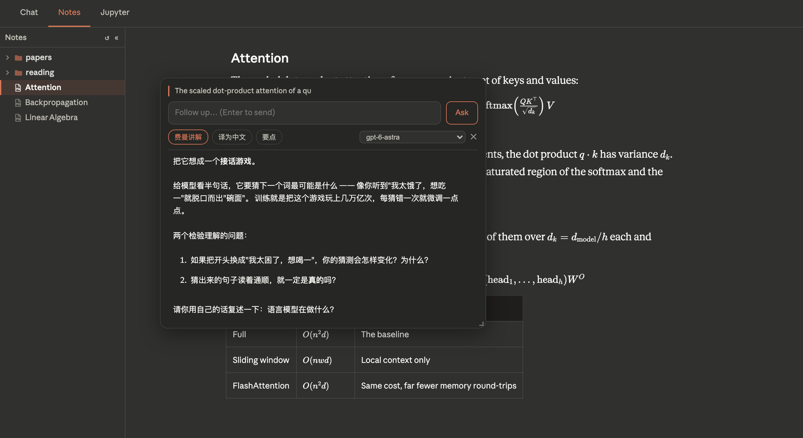

# butter notebooks

**自托管的 Claude / Codex 工作台 —— 对话、笔记、Notebook,浏览器随处可用。**

[English](README.md) · 简体中文

Agent CLI 跑在你自己的机器上,直接操作你的文件。一台小 VPS 负责托管前端、
并通过私有网络代理 API,所以手机上也能用,而机器本身不必暴露在公网。

[](https://www.python.org/)
[](https://fastapi.tiangolo.com/)
[](https://react.dev/)
[](https://vitejs.dev/)
[](LICENSE)


---

## 为什么做这个

Agent CLI 很好用,但它困在终端里。这个项目把它包成一个 Web 应用:同一个会话在
电脑和手机上都能继续,聊天记录落在真正的数据库里,回答到一半刷新也不会丢 ——
同时 agent 依然直接读写本地文件。

## 功能

**两个 agent,同一套界面。** Claude Code 和 Codex 走同一套流式事件协议,界面渲染
完全一致 —— 思考过程、工具调用都在。每个会话单独选 agent 和模型。

**刷新不丢的流式输出。** 响应通过 SSE 推送,边流边落库。回答进行中刷新页面、或者
切到别的会话再切回来,都会重新接上而不是丢失。侧栏的呼吸绿点标记仍在运行的会话。

**Markdown、公式与代码。** 行内与块级 KaTeX、带复制按钮的语法高亮、表格,图片点击
可全屏查看(支持捏合缩放)。

**笔记。** 只读浏览 Markdown 库(Obsidian 或任意文件夹),渲染器与对话共用。PDF
逐页渲染 —— iOS 在 iframe 里只显示第一页,所以改由 pdf.js 自己绘制 —— 源码文件
以等宽字体打开并带语法高亮。

**对着在读的内容提问。** 在笔记里划选一段 —— PDF 也行,它带了专门的文本层 ——
问题会连同这段原文和文件路径一起发给 agent,所以它需要时可以自己打开文件看上下文。
回答出现在一个可拖动、可调整大小的弹层里,还能接着追问。预设按钮覆盖常用问法,其中
一个用费曼学习法讲解这段,最后请你用自己的话复述。这一切都不碰你的会话列表:它走的是
无状态接口,什么都不会被存下来。

**Notebook。** JupyterLab 以标签页嵌入,token 经后端鉴权、反向代理,文件在应用内打开。

**可安装。** 带 service worker 和 iOS 图标的 PWA —— 添加到主屏幕后全屏运行,没有
浏览器外壳。

**兼容 OpenAI 接口。** `/v1/chat/completions` 和 `/v1/models` 让任意 OpenAI 客户端
(比如 Chatbox)直接接入同一个后端,支持图片输入。

<table>
<tr>
<td width="50%"></td>
<td width="50%"></td>
</tr>
<tr>
<td align="center"><em>笔记 —— 文件树、KaTeX、表格</em></td>
<td align="center"><em>在 iOS 上安装为 PWA</em></td>
</tr>
</table>



## 架构

```
  浏览器 / 已安装的 PWA
           │  HTTPS
           ▼
  ┌──────────────────────────────────────────┐
  │ VPS —— nginx                             │
  │   托管构建好的前端                        │
  │   代理 /v1/* 与 /jupyter/*                │
  └──────────────────┬───────────────────────┘
                     │  私有网络(如 Tailscale)
                     ▼
  ┌──────────────────────────────────────────┐
  │ 你的机器 —— FastAPI :8765                 │
  │   ├── Claude CLI     (stream-json)       │
  │   ├── Codex CLI      (exec --json)       │
  │   ├── Jupyter        (:8888)             │
  │   ├── SQLite WAL     (会话存储)           │
  │   └── Markdown 笔记库 (只读)              │
  └──────────────────────────────────────────┘
```

Agent 进程从不监听公网端口。对外暴露的只有 nginx,它通过私有网络访问后端。

### 会话与 session

| | 存在哪 | 由谁决定 |
| --- | --- | --- |
| `convId` | 浏览器,每次请求都带上 | 第一条消息时生成 |
| `session_id` | `conversations` 表,客户端从不发送 | CLI 返回,服务端查库 |

`session_id` 是 CLI 自己的恢复令牌,**不能在两个 agent 之间通用** —— Claude 的
`--resume` token 和 Codex 的 thread id 是两回事。所以对话进行到一半切换 agent 会
被拒绝(409),而不是默默重新开始。

## 环境要求

- macOS 或 Linux,已安装并登录 [Claude Code](https://claude.com/claude-code) 和/或 Codex CLI
- Python 3.12+ 与 Node 20+
- 一台装了 nginx 的 VPS,以及到它的私有网络(Tailscale、WireGuard……)—— 只在局域网内用的话可以不要

## 安装

```bash
git clone <你的 fork> butter-notebooks
cd butter-notebooks

# 后端
cd backend
python3 -m venv .venv && .venv/bin/pip install -r requirements.txt
cp .env.example .env          # 然后按下表填写
.venv/bin/python -m uvicorn main:app --port 8765 --loop asyncio

# 前端
cd ../frontend
npm install
npm run dev                   # http://localhost:5173
```

### 配置

`backend/.env`:

| 变量 | 作用 |
| --- | --- |
| `API_TOKEN` | 共享密钥,前端和任何 API 客户端以 `Bearer` 方式发送 |
| `NOTES_ROOT` | 笔记标签页里只读展示的 Markdown 库 |
| `CODE_ROOT` | 代码沙箱和文件树的根目录(限制访问范围) |
| `SANDBOX_PYTHON` | Python 沙箱使用的解释器 —— 指向装有 numpy/matplotlib 的 venv |
| `PUBLIC_BASE_URL` | 公网地址;决定默认 CORS 来源和图片服务的 URL |
| `JUPYTER_TOKEN` | 必须与启动 Jupyter 时的 token 一致 |
| `JUPYTER_BASE_URL` | 必须与 Jupyter 的 `--NotebookApp.base_url` 一致 |
| `TTS_ENGINE`、`TTS_VOICE_*` | 语音合成的引擎与音色(Edge TTS) |

部署目标放在被 gitignore 的 `deploy.env` 里 —— 复制 `deploy.env.example` 填上
你自己的主机:

```bash
VPS=root@your-vps.example.com
WEB_ROOT=/var/www/butter-notebooks
SITE_URL=https://your-site.example.com
```

> **注意不要提交敏感信息。** 真实的域名、IP、本机路径和密钥只存在于被 gitignore 的
> `backend/.env`、`deploy.env`、`frontend/.env*` 中,仓库里对应的 `*.example` 只放
> 占位符。详见 [CLAUDE.md](CLAUDE.md) 的脱敏章节。

### 部署

```bash
./deploy.sh              # 构建前端并同步到 VPS
./deploy.sh --backend    # 只重启后端服务
./deploy.sh --all        # 两者都做
```

nginx 站点模板见 [`infra/nginx/site.conf`](infra/nginx/site.conf),让后端和 Jupyter
常驻的 launchd 配置见 [`infra/launchd/`](infra/launchd/)。

> 直接用裸 `rsync -a` 部署会把本机的 uid/权限一起带过去,导致 nginx 返回 403。
> `deploy.sh` 会在传输后修正归属。

## 用其它客户端接入

有了 OpenAI 兼容层,任何支持 Chat Completions 的客户端都能用:

| 配置项 | 填什么 |
| --- | --- |
| API 主机 | `https://your-site.example.com/v1` |
| 路径 | `/chat/completions` |
| API 密钥 | 你的 `API_TOKEN` |

它是无状态的(这正是该协议的设计):客户端每次重发完整对话,每一轮都全新执行。
网页端自己的 `/v1/chat` 才会复用 session,所以长任务建议用网页端。

## 目录结构

```
butter-notebooks/
├── frontend/
│   ├── src/
│   │   ├── App.jsx              布局外壳、侧栏、标签页路由
│   │   ├── lib/                 api 封装、常量、主题
│   │   └── components/          ChatPanel、NotesPanel、NotebookPanel、ImageViewer…
│   ├── scripts/
│   │   ├── check-mobile.mjs     用 Playwright 对线上站点做布局断言
│   │   ├── check-ios.sh         同样的检查,但跑在真实的独立 WebKit(iOS 模拟器)里
│   │   └── shots.mjs            重新生成 README 里的截图
│   └── .ios-probe/              check-ios.sh 用的极简 WKWebView 宿主
├── backend/
│   ├── main.py                  FastAPI 应用:对话 SSE、笔记、文件、兼容层
│   ├── chat_store.py            SQLite WAL 存储
│   ├── kernel.py                Python 沙箱(exec + matplotlib 捕获)
│   └── tts.py / stt.py          语音合成与识别
├── infra/                       nginx 站点、launchd 任务
└── deploy.sh
```

## 移动端布局测试

PWA 在手机上的布局问题很难复现 —— 桌面 WebKit 缩到窄视口并不等于 iOS。两个工具:

```bash
cd frontend
node scripts/check-mobile.mjs    # 无头几何断言
./scripts/check-ios.sh           # 同样的检查,跑在真实的独立 WKWebView 里
```

后者会构建一个最小的全屏 WKWebView 应用,装进 iOS 模拟器再探测实际布局 —— 这是
本地唯一能给出与主屏应用相同安全区和视口的环境。

## 注意事项

- 后端必须用 `--loop asyncio` 启动;uvloop 在 launchd 下会卡住。
- macOS 上,运行后端的 Python 需要「完全磁盘访问权限」才能读取 iCloud 笔记库。
  升级 Python 会让二进制路径变化,从而静默失去该权限。
- Code 标签页(Monaco + Python kernel)由 `App.jsx` 里的 `SHOW_CODE_TAB` 控制,
  目前关闭;面板和相关路由都还在。

完整的运维说明见 [CLAUDE.md](CLAUDE.md)。

## 许可证

[MIT](LICENSE)
